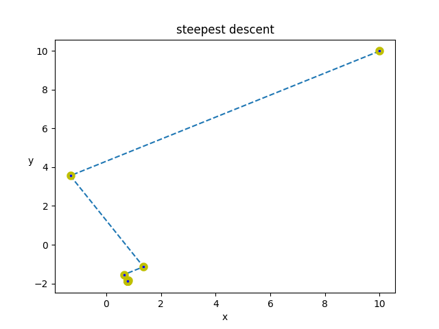
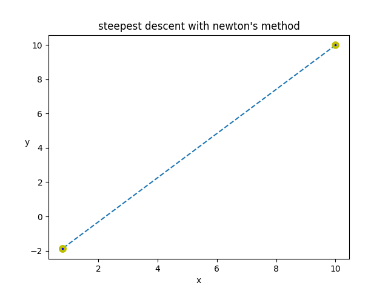
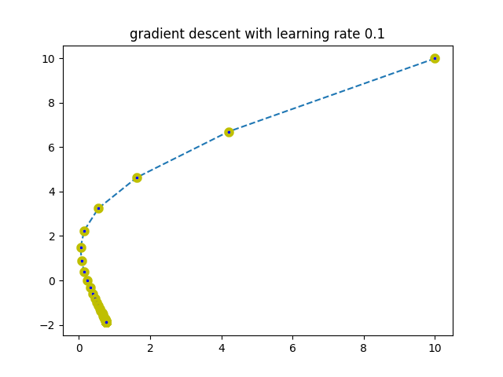
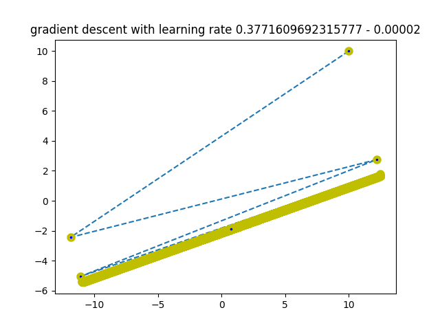

# Optimization-SteepestDescent vs GradientDescent
> Understand working of Steepest-Descent and Gradient-Descent methods  
We will work with Quadratic function. Because any higher dimension problem will be harder to plot and visualize.</h5>

<h2>Problem Statement :-</h1>

 `cost_func_f(x) = (1/2)*x.T*Q*x + b.T*x + c` or `(5/2)* (X2**2)+(Y2**2)+X2*Y2-2*X2+3*Y2+10` where `x = [[X1], [Y1]]`
 
 `Q = np.array([[5,1], [1, 2]])`

`b = np.array([[-2], [3]])`

`c = 10`

`x = np.array([[10], [10]])`
 
 Find point `x` s.t. `cost_func_f(x)` is minimum.

## Different Approaches: 
 * Steepest Descent
 * Gradient Descent

## 1.Steepest Descent: 
> In this learning rate or step size is determined based on algorithm and is not a heuristic value.

<h4> a) Base problem </h4>
<h6>Steepest Descent Method also known as <a href="https://en.wikipedia.org/wiki/Saddle_point" target="_blank">saddle</a> method. In this we move in a direction untill the cost function stops decreasing [i.e. ∇f(dx1)=0, where dx1 is that direction. Cost function may still decrease in other direction]. Then we pick another direction let say dx2. In this each next direction is perpendicular to last direction ( dx1 ⊥ dx2 ). The saddle point is point of contact to the <a href="https://en.wikipedia.org/wiki/Contour_line" target="_blank">contour line</a> where that direction is tangent. 
#iterations: 13</h6>

 

<h4> b) Steepest Descent with Newton's Method </h4>
<h6>In newton's method we approximate our cost function with a similar quadratic equation which behaves similar to our original function in some small neigbourhood. It then tries to find the optiamal pt of that quadratic function. It repeats this process untill stopping criteria is met.
[Note: here since our original function is quadratic function itself so the approximation is same function and thus we reach it's optimal point in one iteration.] 
#iterations: 1</h6>

 

## 2.Gradient Descent:
> In this learning rate or step size is a heuristic value. So we must be very carefull about what we choose as step size. A big step size may create problem and we may never converge to optimal point. [ In general `learning rate` < 2/ λmax (Hf(x)) , for quadratic cost Hf(x) is `Q`.  
so in our problem 2/ λmax(Q) is 0.3771609692315777]
<h4> a) Gradient Descent with learning rate `0.1` </h4> 
<h6>Since leanring rate is much less than the 0.3771609692315777, it will converge nicely. 
#iterations: 86</h6>

 

<h4> b) Gradient Descent with learning rate `0.3771609692315777 - 0.00002` </h4> 
<h6>Since leanring rate is smaller but very close to 0.3771609692315777 it will converge after much oscillation, thus will take much more iterations. 
#iterations: 163093</h6>

 

<h4> c) Gradient Descent with learning rate `0.3771609692315777 + 0.00002` </h4> 
<h6>Since leanring rate is larger than 0.3771609692315777 it will keep oscillating and will never converge.</h6>

<h2> Let's put all our findings in one table</h2> 

| no | algorithm  | #iterations  | 
| :---:   | :-: | :-: |
| 1.a | Steepest Descent (base method) | 13 |
| 1.b | Steepest Descent (newton's method) | 1 |
| 2.a | Gradient Descent (lr=0.1) | 86 |
| 2.b | Gradient Descent (lr=0.3771609692315777 - 0.00002) | 163093 |
| 2.c | Gradient Descent (lr=0.3771609692315777 + 0.00002) | NA |

